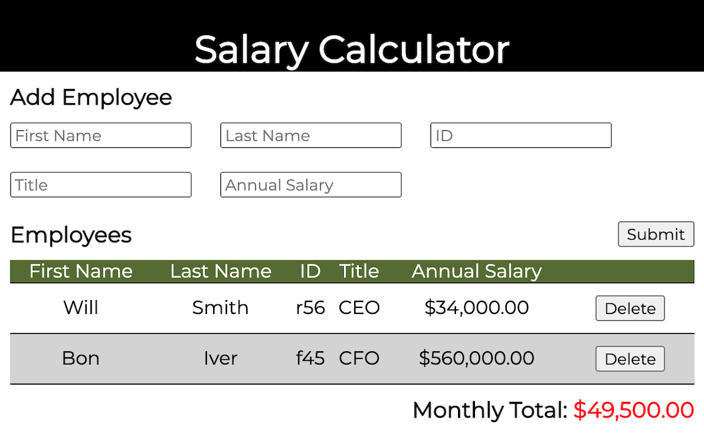

# PROJECT NAME

## Description

2 Day Coding Challenge.

Our startup's Marketing Manager requested a new feature for the exsiting employee intranet portal. This feature would allow the Payroll Division to easily calculate the total monthly salary for all employees and capture relevant data such as ID, TITLE, and ANNUAL SALARY.

To integrate seamlessly with the existing user interface of the employee portal, a wireframe was provided to give guidance for layout and styling options. For a main styling option the Payroll Division requested a screen indicator when the total monthly cost exceeded \$20,000.

The project was seperated into deliverable tasks:

1. Build the User Interface/FORM (HTML)
2. Solve DOM Event Handling (Javascript Functions for Form Submit, Capturing User Input Data for Form)
3. Storing Annual Salary and Employee Data for Retrieval (JSON Objects)
4. Updating a Monthly Cost Total (Adding and Removing based on User Actions)
5. Appending a Table of Entered Employees to DOM (Javascript)
6. Allowing the User to Delete an Employee (Stored Data Updated)
7. Changing the Monthly Total Font Red When Cost Exceeded \$20,000 (Dynamic CSS)
8. Mimick the Wireframe Layout (CSS)

Key accomplishments from this project were building/styling an interface with constraints, thinking ahead about re-using the employee data, and asking great questions to list out the business logic.

## Screen Shot

The wireframe provided by the business.

The new calculator shown in Chrome.

## Installation

Installation was accomplished on the business side.

## Usage

Demonstrated User Experience:

1. Payroll team member enters the employee information to include:
   FIRST NAME, LAST NAME, ID, TITLE and ANNUAL SALARY.
2. User clicks the submit button to show the information in a table.
3. Employees are entered until the Total Monthly salary exceeds \$20,000 and is indicated in red.
4. User can delete individual employees to adjust the overall total and handle multiple scenarios for lists of employees.

## Built With

1. Javascript
2. CSS / HTML
